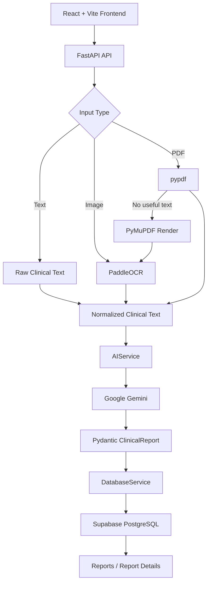

# AI Clinical Document Reviewer

> A simple end-to-end AI application that processes clinical text, images, and PDFs, generates a structured clinical review, and stores the results for later retrieval.


## Overview

The **AI Clinical Document Reviewer** is a full-stack application designed to turn clinical documentation into a structured review.

It accepts three input types:

- Plain clinical text
- Clinical images (PNG, JPG/JPEG, WEBP)
- Clinical PDFs, including scanned/image-only PDFs

The backend normalizes the input into text, sends the text to Gemini for structured clinical review, validates the result with Pydantic, and stores the completed report in Supabase PostgreSQL.

The frontend provides a simple interface for submitting documents, viewing reports, searching reports by patient name, and opening an individual report.

> **Important:** This project is an assistive documentation-review tool for synthetic/test data. It is not intended to provide autonomous medical diagnosis or treatment decisions.

---

## Features

- Analyze raw clinical text with Gemini
- Extract text from clinical images using PaddleOCR
- Extract text from normal PDFs using `pypdf`
- Handle scanned/image-only PDFs using PyMuPDF + PaddleOCR
- Return a structured `ClinicalReport`
- Persist reports in Supabase PostgreSQL
- Retrieve report history
- Search saved reports by patient name
- Open an individual report by ID
- Interactive Swagger/OpenAPI documentation through FastAPI
- Simple black-and-white React interface

---

## Architecture



### Input processing

```text
Text
  -> FastAPI
  -> AIService
  -> Gemini
  -> ClinicalReport

Image
  -> PaddleOCR
  -> extracted text
  -> AIService
  -> Gemini
  -> ClinicalReport

PDF
  -> pypdf
  -> extracted text
  -> AIService
  -> Gemini
  -> ClinicalReport

Scanned PDF
  -> pypdf detects no useful text
  -> PyMuPDF renders page to image
  -> PaddleOCR
  -> extracted text
  -> AIService
  -> Gemini
  -> ClinicalReport
```

---

## Tech Stack

### Frontend

- React
- Vite
- React Router 7
- Vanilla CSS

### Backend

- Python
- FastAPI
- Pydantic
- Google Gemini API
- PaddleOCR
- PaddlePaddle
- PyMuPDF
- pypdf
- Supabase Python client

### Database

- PostgreSQL via Supabase
- JSONB for the structured clinical report

---

## Project Structure

```text
ai-clinical-document-reviewer/
│
├── backend/
│   ├── app/
│   │   ├── models/
│   │   ├── routes/
│   │   │   └── analysis.py
│   │   ├── schemas/
│   │   │   └── analysis.py
│   │   ├── services/
│   │   │   ├── ai_service.py
│   │   │   ├── ocr_service.py
│   │   │   ├── pdf_service.py
│   │   │   └── database_service.py
│   │   └── main.py
│   │
│   ├── test_data/
│   ├── test_ocr.py
│   ├── test_pdf.py
│   ├── test_database.py
│   ├── requirements.txt
│   ├── .env.example
│   └── .gitignore
│
├── frontend/
│   ├── src/
│   │   ├── components/
│   │   │   └── Navbar.jsx
│   │   ├── pages/
│   │   │   ├── Home.jsx
│   │   │   ├── Analyze.jsx
│   │   │   ├── Reports.jsx
│   │   │   └── ReportDetails.jsx
│   │   ├── services/
│   │   │   └── api.js
│   │   ├── App.jsx
│   │   ├── router.jsx
│   │   ├── main.jsx
│   │   └── index.css
│   ├── package.json
│   └── package-lock.json
│
└── .gitignore
```

---

## Local Setup

### Prerequisites

Install:

- Python 3.13.x (the version used during development)
- Node.js 24.x (the version used during development)
- npm
- A Google Gemini API key
- A Supabase account and project

The project was developed and tested on Windows using **CMD**.

---

## 1. Clone the repository

```cmd
git clone https://github.com/peeyoush/ai-clinical-document-reviewer.git
cd ai-clinical-document-reviewer
```

---

## 2. Backend setup

Go to the backend:

```cmd
cd backend
```

Create the Python virtual environment:

```cmd
python -m venv venv
```

Activate it in CMD:

```cmd
venv\Scripts\activate
```

Install dependencies:

```cmd
python -m pip install -r requirements.txt
```

---

## 3. Backend environment variables

Copy the example file:

```cmd
copy .env.example .env
```

Open `backend/.env` and add your real credentials:

```env
APP_ENV=development

GEMINI_API_KEY=your_gemini_api_key
GEMINI_MODEL=gemini-3.8-flash

SUPABASE_URL=https://your-project.supabase.co
SUPABASE_SECRET_KEY=your_supabase_secret_key
```

### Never commit `.env`

The `.env` file is intentionally ignored by Git.

Do not expose `GEMINI_API_KEY` or `SUPABASE_SECRET_KEY` in the frontend or in GitHub.

---

## 4. Supabase database setup

Create a Supabase project and open the **SQL Editor**.

Run:

```sql
create table public.clinical_reports (
    id uuid primary key default gen_random_uuid(),

    source_type text not null
        check (source_type in ('text', 'image', 'pdf')),

    original_filename text,

    extracted_text text,

    report jsonb not null,

    created_at timestamptz not null default now()
);

alter table public.clinical_reports enable row level security;

grant all on table public.clinical_reports to service_role;
```

The backend uses the Supabase server-side secret key to access this table.

The `report` column stores the validated `ClinicalReport` as PostgreSQL `jsonb`.

---

## 5. Start the backend

From `backend/` with the virtual environment active:

```cmd
uvicorn app.main:app --reload
```

Backend:

```text
http://127.0.0.1:8000
```

Swagger UI:

```text
http://127.0.0.1:8000/docs
```

OpenAPI JSON:

```text
http://127.0.0.1:8000/openapi.json
```

---

## 6. Frontend setup

Open a **new CMD window** and go to the frontend:

```cmd
cd /d D:\GGSOC\ai-clinical-document-reviewer\frontend
```

Install packages:

```cmd
npm install
```

Start Vite:

```cmd
npm run dev
```

Frontend:

```text
http://localhost:5173
```

---

## API Endpoints

| Method | Endpoint | Purpose |
|---|---|---|
| `GET` | `/api/health` | Backend health check |
| `POST` | `/api/analyze` | Analyze plain clinical text |
| `POST` | `/api/analyze/image` | OCR + clinical analysis for images |
| `POST` | `/api/analyze/pdf` | PDF text extraction + clinical analysis |
| `GET` | `/api/reports` | Retrieve saved reports |
| `GET` | `/api/reports?patient_name=John` | Search reports by patient name |
| `GET` | `/api/reports/{id}` | Retrieve one saved report |

---

## ClinicalReport Structure

The AI response is validated using Pydantic and follows this structure:

```json
{
  "report_summary": "...",
  "patient_information": {
    "name": "...",
    "age": "...",
    "gender": "...",
    "mrn": "..."
  },
  "symptoms": [],
  "diagnoses": [],
  "medications": [],
  "vitals": {
    "blood_pressure": "...",
    "heart_rate": "...",
    "temperature": "...",
    "respiratory_rate": "...",
    "oxygen_saturation": "..."
  },
  "allergies": [],
  "clinical_observations": [],
  "clinical_concerns": [],
  "missing_information": [],
  "potential_inconsistencies": [],
  "requires_review": []
}
```

The AI service is instructed to extract documented information, preserve uncertainty, avoid inventing diagnoses, identify missing information/inconsistencies, and flag items requiring human review.

---

## Testing

### OCR test

From `backend/`:

```cmd
python test_ocr.py
```

### Text-based PDF test

```cmd
python test_pdf.py
```

### Database connection test

```cmd
python test_database.py
```

### API testing

Use FastAPI Swagger:

```text
http://127.0.0.1:8000/docs
```

The same endpoints can later be called by the React frontend.

---

## Frontend Pages

### Home

A simple landing page explaining the application and linking to document analysis.

### Analyze

Supports:

- Text input
- Image upload
- PDF upload

### Reports

Displays saved reports and supports patient-name search.

### Report Details

Displays the complete structured report and the extracted document text.

---

## Database Model

The current database intentionally keeps the schema simple:

```text
clinical_reports
├── id
├── source_type
├── original_filename
├── extracted_text
├── report (jsonb)
└── created_at
```

This avoids over-normalizing a student project while still preserving the structured report returned by the AI service.

---

## Design Decisions

### One analysis service for all input types

Text, image, and PDF processing eventually produce normalized text. The same `AIService` handles the clinical review for all three paths.

### OCR is isolated

`OCRService` is responsible only for converting images into text. It does not contain Gemini or clinical-review logic.

### PDF processing has a fallback

Normal PDFs use `pypdf`. If a page has no useful text layer, PyMuPDF renders the page to an image and the existing OCR service processes it.

### No RAG in the core pipeline

The current application does not require retrieval-augmented generation. It focuses on document processing, structured extraction, review, and persistence.

### No autonomous clinical decision-making

The system is designed as an assistive review tool. It should not invent diagnoses or treatment plans that are not documented in the source material.

---

## Current Project Status

- [x] FastAPI backend
- [x] Gemini clinical analysis
- [x] Structured Pydantic ClinicalReport
- [x] Image OCR with PaddleOCR
- [x] Text PDF extraction
- [x] Scanned PDF OCR fallback
- [x] Supabase persistence
- [x] Report retrieval
- [x] Patient-name search
- [x] React + Vite frontend
- [x] React Router 7
- [x] Text/image/PDF frontend workflow
- [x] Report history UI
- [x] Report detail UI
- [ ] Production deployment
- [ ] Final production environment configuration

---

## Deployment

Planned deployment structure:

```text
React frontend
    ↓
Vercel / Netlify
    ↓
FastAPI backend
    ↓
Koyeb / Render
    ↓
Supabase PostgreSQL
```

Production deployment should use environment variables for API URLs and all secrets. The current frontend development configuration points to the local FastAPI server and should be changed before deployment.

---

## Project Purpose

This project was built as an end-to-end AI/ML application to demonstrate:

- API development with FastAPI
- multimodal document processing
- OCR integration
- structured LLM output
- PostgreSQL/Supabase persistence
- React frontend development
- frontend-backend API integration

---
